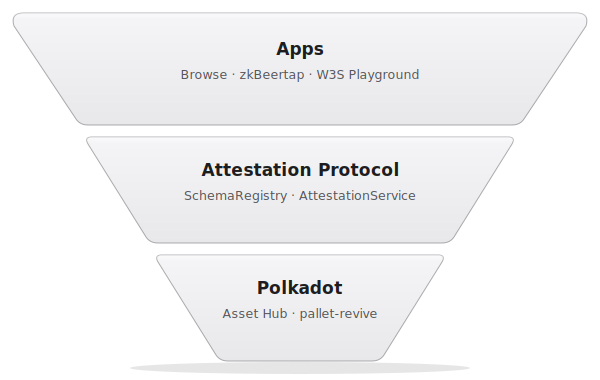
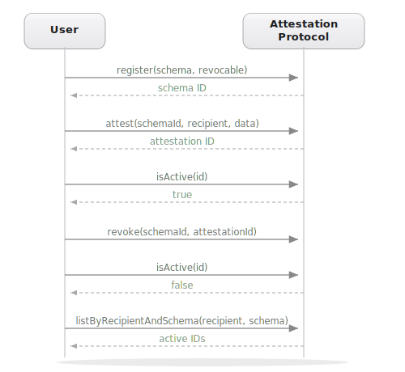
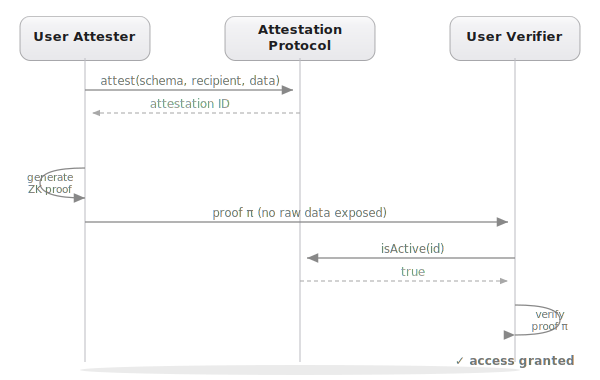

# Polkadot Attestation Protocol

Co-authored by @Corey-Hathaway, @Utkarsh_Bhardwaj, @Monica_Chen_Jin.

Source: https://github.com/paritytech/attestation-protocol

## The problem

Several apps, particularly Browse, zkBeerTap, and the W3S Playground, need a way to record user attestations: likes, dislikes, ratings, and verifications. These attestations are also the basic building blocks for proper reputation, honour, and trust systems across the ecosystem. We need a single, audited, and battle-tested  protocol that everyone can use.

## Background

This work first started as part of Protocol Commons, a library of multi-tenant, deployed smart contract primitives. The original implementation was kicked off by @William_Chen.

## What it is

A public notary for Polkadot. Anyone can define what they want to attest to, issue verifiable claims, and revoke them when needed.



Here are some of the things it unlocks:

**Browse** registers a `"bool upvote"` schema marked as **unique** so each user can only have one active upvote per app at a time. Re-upvoting overwrites the previous attestation in-place rather than accumulating duplicates.

**zkBeerTap** uses a `"bool verified"` schema where trusted attesters confirm that an account has verified their age via a zero-knowledge proof of their passport. The frontend calls `isActiveAny(recipient, schema, trustedAttesters)` on the schema's bound resolver before pouring a virtual beer.

**W3S Playground** lets users rate published snippets with a `"uint8 rating"` schema. Ratings are attestations: portable, queryable, revocable.

Beyond these first use cases, attestations are a general-purpose primitive. Anywhere you'd **verify**, **vouch**, **vote**, **rate**, **certify**, or **prove**, there's probably an attestation behind it. Because attestations live on-chain and aren't tied to any single app, any app can interoperate with another's attestations: a new app can build on Browse's upvotes or zkBeerTap's verifications without coordination. The protocol gives you the primitive and gets out of the way.

## How it works

The protocol has two contracts: a **SchemaRegistry** where you define the shape of your claims, and an **AttestationService** where claims are created, revoked, and queried.



### Schemas

A schema defines the shape of a claim. It has a human-readable field spec (e.g. `"bool upvote"`, `"uint8 rating, string review"`), a `revocable` flag, and a `unique` flag. When a schema is registered as `unique`, the protocol enforces **one active attestation per (attester, recipient, schema) triple**. Re-attesting doesn't create a new record. It overwrites the existing one in-place.

## ZK and attestations

Attestations and zero-knowledge proofs are a natural pair. An attestation records a claim on-chain. A ZK proof lets you verify a property of that claim without revealing the underlying data.



Consider a proof-of-age flow. The account generates a zero-knowledge proof of their passport showing the holder is 21 or older, then submits it to zkBeerTap's attester. The attester runs the proof against the verifier circuits, and only if it passes does it write a `"bool verified"` attestation to the protocol. The chain learns the result (this address has been verified by this attester) and nothing else. Not the name or date of birth, not the document number, not the country, not any other detail on the passport.

The protocol is ZK-agnostic by design. The `data` field is opaque bytes. It can carry a raw value, a hash, or a cryptographic commitment. Attestations can anchor the public inputs for a proof circuit, serve as the statement being proved, or both. The chain records what was claimed. ZK controls what is revealed.

## Anatomy of an attestation

| Field | Description |
|-------|-------------|
| `id` | Sequential ID for non-unique schemas, or deterministic `keccak256(attester, recipient, schema)` for unique schemas |
| `schema` | The schema ID this attestation conforms to |
| `attester` | The account that created the attestation |
| `recipient` | The account the attestation is about |
| `data` | ABI-encoded payload matching the schema |
| `expirationTime` | Optional expiry (0 = never expires) |
| `revocationTime` | Set when revoked (0 = not revoked) |
| `revocable` | Whether the attester can later revoke it |
| `refId` | Optional reference to a parent attestation |

## Architecture

```
SchemaRegistry              AttestationService
┌──────────────────┐        ┌───────────────────────────────────────────┐
│ register()       │◄───────│ attest() / attestByDelegation()           │
│ getSchema()      │        │ multiAttest() / multiAttestByDelegation() │
│ schemaCount()    │        │ revoke() / revokeByDelegation()           │
│ version()        │        │ multiRevoke() / multiRevokeByDelegation() │
└──────────────────┘        │ timestamp() / multiTimestamp()            │
                            │ revokeOffchain() / multiRevokeOffchain()  │
                            │ getAttestationById() / getAttestationByIds│
                            │ isAttestationValid() / isActive()         │
                            │ attestationCount()                        │
                            │ getTimestamp() / getRevokeOffchain()      │
                            │ getSchemaRegistry() / version()           │
                            └─────────────────────┬─────────────────────┘
                                                  │ onAttest / onRevoke
                                                  ▼
                            ┌───────────────────────────────────────────┐
                            │ IAttestationResolver (per-schema, opt-in) │
                            │                                           │
                            │ Reference impl:                           │
                            │ RecipientAndAttesterIndexResolver         │
                            │  • isActiveAny()                          │
                            │  • countByRecipientAndSchema()            │
                            │  • listByRecipientAndSchema()             │
                            │  • countByAttester() / listByAttester()   │
                            └───────────────────────────────────────────┘
```

Discovery (`isActiveAny`, `countBy*`, `listBy*`) lives on a per-schema `IAttestationResolver` rather than the core service. Schemas opt in by binding a resolver address at registration. The protocol ships `RecipientAndAttesterIndexResolver` as a reference implementation that maintains by-`(recipient, schema)` and by-attester collections. Schemas that don't bind a resolver get core attestation storage with no on-chain enumeration. Broader queries go through events and an optional off-chain indexer.

## Join us

Issues and contributions are welcome at https://github.com/paritytech/attestation-protocol/issues.